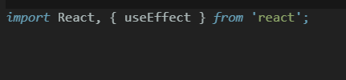
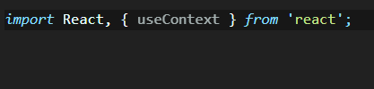
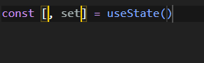
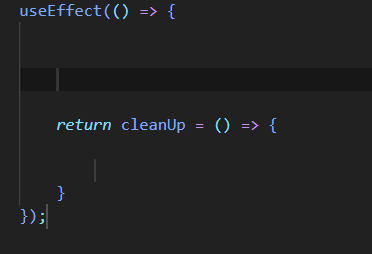
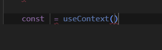
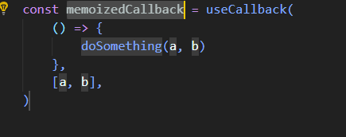
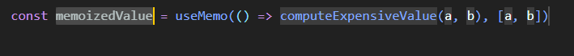
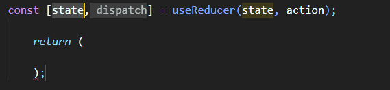
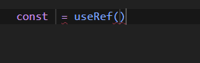

# React-Hooks README

This is React Hooks code snippets for faster and efficient code

## Features

Hooks are supported: `useState`, `useEffect`, `useContext`, `useCallback`, and `useMemo` ,`useRef`,`useReducer`

### import useState
Type `imrus` to  "Import React, { useState }"

 

### import useEffect
Type `imrue` to  "Import React, { useEffect }"

 

### import useContext
Type `imruc` to  "Import React, { useContext }"

 

### useState
Type `ust` to useState

 

### useEffect
Type `uef` to useEffect

 

### useContext
Type `uct` to useContext

 

### useCallback
Type `ucb` to useCallback

 

### useMemo
Type `umo` to useMemo

 

### useReducer
Type `urd` to useReducer

### useRef
Type `urf` to useRef

