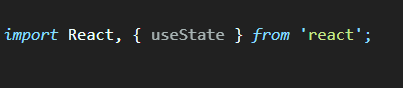

# React-Hooks README

This is React Hooks code snippets for faster and efficient code

## Features

Hooks are supported: `useState`, `useEffect`, `useContext`, `useCallback`, and `useMemo` ,`useRef`

### import useState
Type `imrus` to  "Import React, { useState }"

 

### import useEffect
Type `imrue` to  "Import React, { useEffect }"

### import useContext
Type `imruc` to  "Import React, { useContext }"

### useState
Type `ust` to useState

### useEffect
Type `uef` to useEffect

### useContext
Type `uct` to useContext

### useCallback
Type `ucb` to useCallback

### useMemo
Type `umo` to useMemo
